# Ditto Vault — Technical Architecture

> Canton Network · CIP-56 · Daml Smart Contracts

---

## Table of Contents

- [1. System Overview](#1-system-overview)
- [2. Canton Domain Model](#2-canton-domain-model)
- [3. CIP-56 Token Integration](#3-cip-56-token-integration)
- [4. NAV Oracle & Pricing](#4-nav-oracle--pricing)
- [5. Lifecycle Flows](#5-lifecycle-flows)
- [6. Liquidity Pool](#6-liquidity-pool)
- [7. Cross-Chain Bridge](#7-cross-chain-bridge)
- [8. Backend Services](#8-backend-services)
- [9. Security Model](#9-security-model)
- [10. Deployment Architecture](#10-deployment-architecture)
- [11. Why Ditto?](#11-why-ditto)
- [12. References](#12-references)

---

## 1. System Overview

Ditto Vault operates across two execution environments connected by a backend orchestration layer:

- **Canton Network** — tokenization, accounting, and settlement via Daml smart contracts and CIP-56 token standard
- **EVM Chains** — yield generation across DeFi money markets (Aave, Morpho, Fluid, Spark), secured by Ditto Network's 16 decentralized operators

The Canton side never touches actual funds in the MVP. It tracks NAV, manages vault shares (dvUSDC), and provides institutional-grade workflows. The EVM side is the existing yield engine. A backend service bridges state between the two.

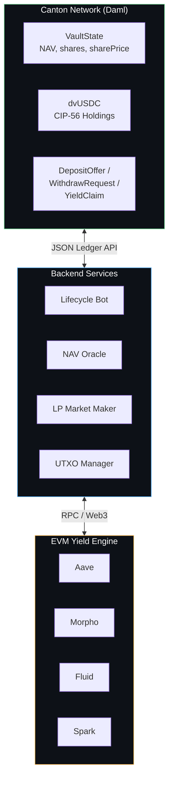

---

## 2. Canton Domain Model

All on-chain state lives in Daml contracts deployed to the Canton participant node. The contracts follow Canton's ledger model: contracts are immutable, exercised choices consume the input contract and create new ones (UTXO-style).

### 2.1 VaultState

Singleton contract owned by the vault operator (curator). Tracks pool-level accounting.

```daml
template VaultState
  with
    vaultId       : Text
    operator      : Party
    totalShares   : Decimal
    currentNAV    : Decimal      -- total vault value in USDC terms
    sharePrice    : Decimal      -- currentNAV / totalShares
    lastNAVUpdate : Time
    feeRateBps    : Int          -- management fee in basis points (50-200)
    isPaused      : Bool         -- emergency pause flag
  where
    signatory operator

    choice UpdateNAV : ContractId VaultState
      with
        newNAV     : Decimal
        updateTime : Time
      controller operator
      do
        assertMsg "Vault is paused" (not isPaused)
        assertMsg "NAV must be non-negative" (newNAV >= 0.0)
        let newPrice = if totalShares > 0.0
              then newNAV / totalShares
              else 1.0
        create this with
          currentNAV = newNAV
          sharePrice = newPrice
          lastNAVUpdate = updateTime

    choice RecordMint : ContractId VaultState
      with
        mintedShares  : Decimal
        depositAmount : Decimal
      controller operator
      do
        assertMsg "Shares must be positive" (mintedShares > 0.0)
        create this with
          totalShares = totalShares + mintedShares
          currentNAV  = currentNAV + depositAmount

    choice RecordBurn : ContractId VaultState
      with
        burnedShares   : Decimal
        withdrawAmount : Decimal
      controller operator
      do
        assertMsg "Shares must be positive" (burnedShares > 0.0)
        assertMsg "Cannot burn more than total" (burnedShares <= totalShares)
        create this with
          totalShares = totalShares - burnedShares
          currentNAV  = currentNAV - withdrawAmount

    choice PauseVault : ContractId VaultState
      controller operator
      do create this with isPaused = True

    choice UnpauseVault : ContractId VaultState
      controller operator
      do create this with isPaused = False
```

**Key invariants:**
- `sharePrice = currentNAV / totalShares` (when `totalShares > 0`)
- Only the operator can exercise choices (curator-gated)
- `isPaused` blocks NAV updates and, by extension, all minting/burning

### 2.2 DepositOffer

Created by a user (depositor) to request entry into the vault.

```daml
template DepositOffer
  with
    depositor     : Party
    operator      : Party
    depositAmount : Decimal      -- USDCx amount
    createdAt     : Time
  where
    signatory depositor
    observer operator

    choice AcceptDeposit : ()
      with
        sharesToMint : Decimal
        vaultStateId : ContractId VaultState
      controller operator
      do
        assertMsg "Shares must be positive" (sharesToMint > 0.0)
        -- Operator validates: sharesToMint ≈ depositAmount / sharePrice
        -- Actual mint via BurnMintFactory happens in the backend transaction
        -- RecordMint on VaultState happens in the same transaction
        pure ()

    choice CancelDeposit : ()
      controller depositor
      do pure ()

    choice RejectDeposit : ()
      controller operator
      do pure ()
```

### 2.3 WithdrawRequest

Created by a dvUSDC holder to request redemption.

```daml
template WithdrawRequest
  with
    holder        : Party
    operator      : Party
    sharesToBurn  : Decimal      -- dvUSDC amount
    createdAt     : Time
  where
    signatory holder
    observer operator

    choice AcceptWithdraw : ()
      with
        redemptionAmount : Decimal   -- USDCx to return
        vaultStateId     : ContractId VaultState
      controller operator
      do
        assertMsg "Redemption must be positive" (redemptionAmount > 0.0)
        -- Operator validates: redemptionAmount ≈ sharesToBurn * sharePrice
        -- Actual burn via BurnMintFactory happens in the backend transaction
        -- RecordBurn on VaultState happens in the same transaction
        pure ()

    choice CancelWithdraw : ()
      controller holder
      do pure ()
```

### 2.4 YieldClaim

Allows a user to harvest accrued yield without redeeming their full position.

```daml
template YieldClaim
  with
    holder          : Party
    operator        : Party
    initialShares   : Decimal    -- shares at time of deposit
    currentShares   : Decimal    -- shares held now (same count)
    autoCompound    : Bool       -- if True, reinvest yield
  where
    signatory holder
    observer operator

    choice AcceptClaim : ()
      with
        yieldInUSDCx   : Decimal
        sharesToBurn   : Decimal  -- yield portion expressed in shares
        vaultStateId   : ContractId VaultState
      controller operator
      do
        assertMsg "Yield must be positive" (yieldInUSDCx > 0.0)
        -- If autoCompound: burn yield shares, immediately re-mint at current price
        -- If not: burn yield shares, transfer USDCx to holder
        pure ()
```

---

## 3. CIP-56 Token Integration

dvUSDC is a CIP-56-compliant token, making it interoperable with any Canton wallet, DvP settlement flow, and third-party Canton applications.

### 3.1 Token Registration

The vault operator registers as an **Instrument Admin** in the Canton Registry Utility:

1. **Create `AllocationFactory`** — enables users to lock dvUSDC holdings for transfer offers and DvP settlement
2. **Create `TransferRule`** — defines credential requirements for peer-to-peer dvUSDC transfers

Registration makes dvUSDC discoverable in Canton wallets and enables activity marker generation.

### 3.2 Instrument Metadata

```
Instrument ID    : dvUSDC
Instrument Admin : <operator-party-id>
Token Standard   : CIP-56
Decimals         : 6
Description      : Ditto Vault yield-bearing USDC token
```

### 3.3 Minting (on deposit)

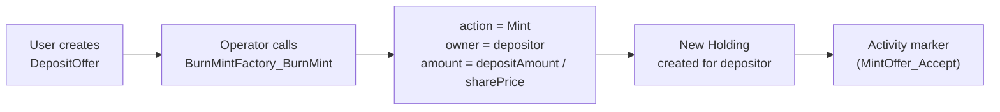

### 3.4 Burning (on withdrawal)

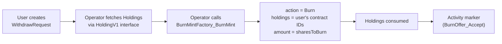

### 3.5 Transfers

Standard CIP-56 peer-to-peer transfers via `TransferFactory_Transfer`:

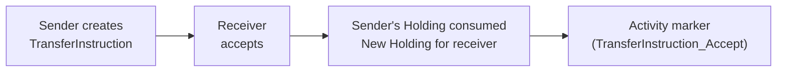

### 3.6 Holdings (UTXO Model)

CIP-56 holdings follow a UTXO model. Each mint creates a new holding contract. Multiple deposits create multiple holdings for the same user.

**Fragmentation management:**
- `MergeDelegation` allows the operator to merge multiple small holdings into one, reducing state and earning additional activity markers
- The backend periodically scans for users with >N holdings and triggers merges

---

## 4. NAV Oracle & Pricing

### 4.1 NAV Update Flow

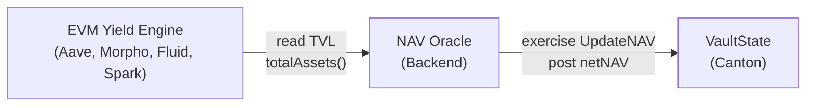

1. NAV Oracle reads total vault value from EVM vault contracts via RPC
2. Applies management fee accrual: `netNAV = grossNAV - accruedFee`
3. Exercises `UpdateNAV` on VaultState with the net NAV
4. VaultState recalculates `sharePrice = currentNAV / totalShares`

### 4.2 Update Frequency

| Phase | Frequency | Rationale |
|---|---|---|
| MVP | Every 15 minutes | Sufficient for demo, generates ~96 NAV updates/day |
| Production | Every block (~12s) or on significant NAV change (>0.1%) | Real-time accuracy for institutional users |

### 4.3 Share Price Calculation

```
sharePrice = currentNAV / totalShares

On deposit:
  sharesToMint = depositAmount / sharePrice

On withdrawal:
  redemptionAmount = sharesToBurn × sharePrice

Yield per user:
  yieldValue = (currentSharePrice - entrySharePrice) × userShares
```

### 4.4 Fee Accrual

Management fee is accrued continuously and deducted from NAV before posting:

```
annualFeeRate = feeRateBps / 10000
timeFraction  = secondsSinceLastUpdate / secondsPerYear
accruedFee    = grossNAV × annualFeeRate × timeFraction
netNAV        = grossNAV - accruedFee
```

---

## 5. Lifecycle Flows

### 5.1 Deposit Flow

```mermaid
sequenceDiagram
    actor User
    participant FE as Frontend
    participant BE as Backend (Operator)
    participant CN as Canton Ledger

    User->>FE: deposit(amount)
    FE->>CN: create DepositOffer
    CN-->>BE: DepositOffer contract active

    BE->>CN: read VaultState
    CN-->>BE: sharePrice

    Note over BE: shares = amount / sharePrice

    rect rgb(30, 50, 30)
        Note over BE,CN: Atomic Transaction
        BE->>CN: 1. AcceptDeposit
        BE->>CN: 2. BurnMintFactory Mint(shares)
        BE->>CN: 3. RecordMint on VaultState
    end

    CN-->>BE: Holding(dvUSDC) created
    BE-->>FE: tx result
    FE-->>User: confirmation
```

All three operations (accept deposit, mint dvUSDC, record mint) execute in a **single atomic Canton transaction**, guaranteeing consistent state.

### 5.2 Withdrawal Flow

```mermaid
sequenceDiagram
    actor User
    participant FE as Frontend
    participant BE as Backend (Operator)
    participant CN as Canton Ledger

    User->>FE: withdraw(shares)
    FE->>CN: create WithdrawRequest
    CN-->>BE: WithdrawRequest contract active

    BE->>CN: read VaultState
    CN-->>BE: sharePrice

    Note over BE: redemption = shares × sharePrice

    rect rgb(30, 50, 30)
        Note over BE,CN: Atomic Transaction
        BE->>CN: 1. AcceptWithdraw
        BE->>CN: 2. BurnMintFactory Burn(shares)
        BE->>CN: 3. RecordBurn on VaultState
    end

    CN-->>BE: dvUSDC Holdings consumed
    BE-->>FE: tx result + USDCx transfer
    FE-->>User: USDCx returned
```

### 5.3 Yield Claim Flow

```mermaid
sequenceDiagram
    actor User
    participant BE as Backend (Operator)
    participant CN as Canton Ledger

    User->>BE: claimYield()
    BE->>CN: read user dvUSDC Holdings
    BE->>CN: read VaultState
    CN-->>BE: holdings + sharePrice

    Note over BE: yieldShares = shares ×<br/>(1 - entryPrice / currentPrice)

    rect rgb(30, 50, 30)
        Note over BE,CN: Atomic Transaction
        BE->>CN: 1. AcceptClaim
        BE->>CN: 2. Burn(yieldShares)
        BE->>CN: 3. RecordBurn
        alt autoCompound = true
            BE->>CN: 4. Re-mint at current price
        else autoCompound = false
            BE->>CN: 4. Transfer USDCx to holder
        end
    end

    BE-->>User: yield distributed
```

---

## 6. Liquidity Pool

An on-chain secondary market for instant dvUSDC exits without waiting for the withdrawal queue.

### 6.1 Pool Design

```daml
template LiquidityPool
  with
    operator       : Party
    dvUSDCReserve  : Decimal     -- dvUSDC in pool
    usdcxReserve   : Decimal     -- USDCx in pool
    swapFeeBps     : Int         -- 10-30 bps
    lastRebalance  : Time
  where
    signatory operator

    choice SwapDvUSDCForUSDCx : ContractId LiquidityPool
      with
        seller       : Party
        dvUSDCAmount : Decimal
      controller operator
      do
        let fee       = dvUSDCAmount * (intToDecimal swapFeeBps / 10000.0)
            netAmount = dvUSDCAmount - fee
            usdcxOut  = netAmount * (usdcxReserve / dvUSDCReserve)
        assertMsg "Insufficient USDCx liquidity" (usdcxOut <= usdcxReserve)
        create this with
          dvUSDCReserve = dvUSDCReserve + dvUSDCAmount
          usdcxReserve  = usdcxReserve - usdcxOut

    choice Rebalance : ContractId LiquidityPool
      with
        newDvUSDCReserve : Decimal
        newUSDCxReserve  : Decimal
        rebalanceTime    : Time
      controller operator
      do create this with
          dvUSDCReserve = newDvUSDCReserve
          usdcxReserve  = newUSDCxReserve
          lastRebalance = rebalanceTime
```

### 6.2 Arbitrage Mechanism

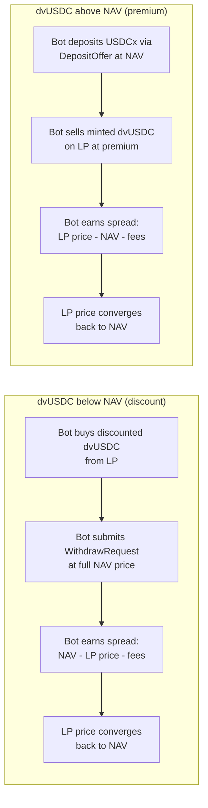

Each arbitrage cycle generates multiple CIP-56 transactions (mint, burn, transfer, swap) — all economically motivated.

### 6.3 Transaction Generation

| LP Operation | CIP-56 Transactions Generated |
|---|---|
| Swap dvUSDC → USDCx | Transfer (seller → pool) + Transfer (pool → seller) |
| Arbitrage buy + redeem | Transfer (pool → bot) + Burn (bot dvUSDC) |
| Arbitrage mint + sell | Mint (bot dvUSDC) + Transfer (bot → pool) |
| Rebalance | Transfer(s) for reserve adjustments |

---

## 7. Cross-Chain Bridge

### 7.1 MVP (Phase 1–2)

No actual fund movement. The NAV Oracle reads EVM vault TVL and posts it to Canton. Deposits/withdrawals are accounted on Canton only.

### 7.2 Production (Phase 2+)

Integration with **Circle xReserve** for actual USDCx ↔ USDC bridging:

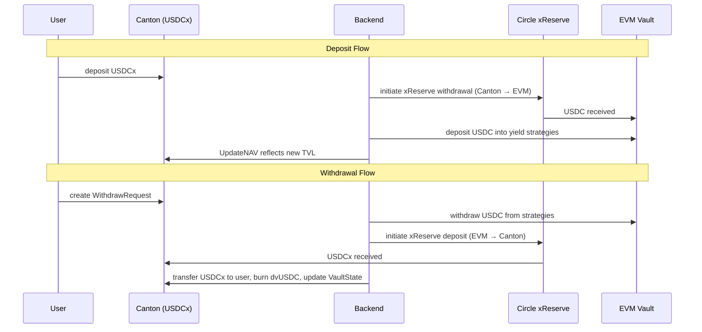

### 7.3 Bridge Architecture

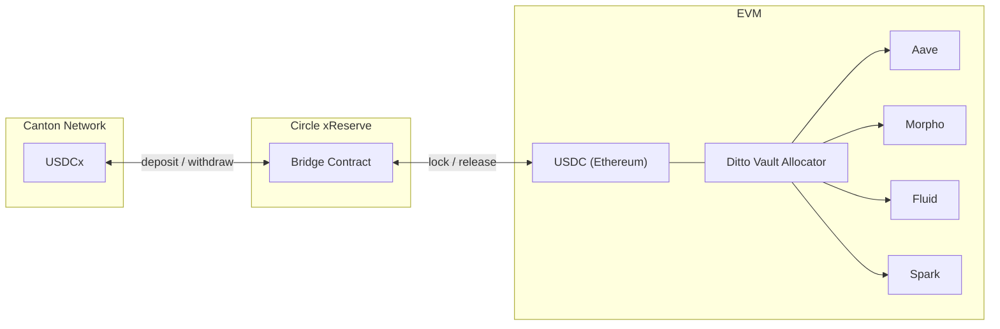

---

## 8. Backend Services

The backend runs as a set of services that interact with both Canton (via JSON Ledger API) and EVM (via RPC).

### 8.1 Lifecycle Bot

Polls for pending workflow contracts and processes them atomically.

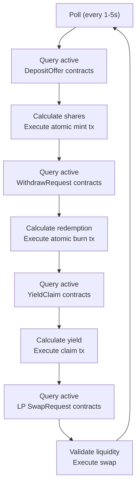

**Atomic transaction composition** (single Ledger API command):
```json
{
  "commands": [
    { "exercise": { "template": "DepositOffer", "choice": "AcceptDeposit", ... } },
    { "exercise": { "template": "BurnMintFactory", "choice": "BurnMint_Mint", ... } },
    { "exercise": { "template": "VaultState", "choice": "RecordMint", ... } }
  ]
}
```

All three commands execute atomically — if any fails, the entire transaction rolls back.

### 8.2 NAV Oracle

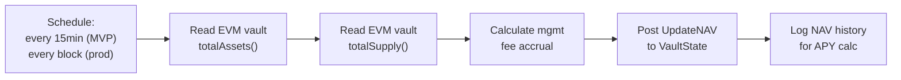

### 8.3 UTXO Manager

CIP-56 holdings follow a UTXO model. Frequent deposits create holding fragmentation.

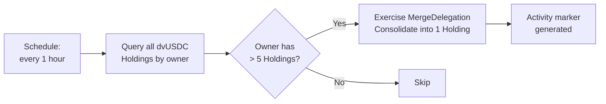

### 8.4 LP Market Maker

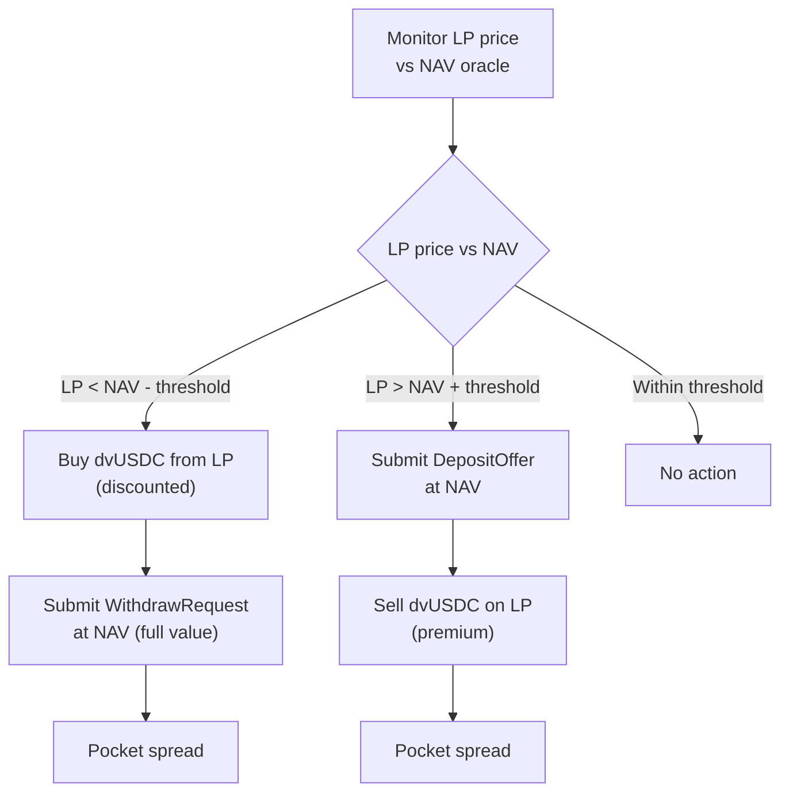

---

## 9. Security Model

### 9.1 Canton Security (Daml)

| Control | Implementation |
|---|---|
| **Authorization** | Every contract choice has explicit `controller` — only the designated party can exercise |
| **Signatory model** | `DepositOffer` signed by depositor, observed by operator. Operator cannot forge deposits |
| **Atomic execution** | Multi-contract transactions are all-or-nothing. No partial state updates |
| **Privacy** | Canton's sub-transaction privacy ensures parties only see contracts they are signatories/observers of |
| **Audit trail** | Every contract creation and archival is recorded on the Canton ledger with full provenance |

### 9.2 Operator Controls

| Risk | Mitigation |
|---|---|
| **NAV manipulation** | Only operator can update NAV; backend reads directly from EVM contracts (no manual input) |
| **Unauthorized minting** | Minting requires a DepositOffer signed by the depositor — operator cannot self-mint |
| **Fund extraction** | Withdrawal requires a WithdrawRequest signed by the holder — operator cannot unilaterally burn |
| **Emergency** | `PauseVault` choice halts all operations immediately |
| **Operator key compromise** | Future: multi-party `VaultPolicy` with quorum threshold for critical operations |

### 9.3 EVM Security

| Control | Implementation |
|---|---|
| **Operator decentralization** | 16 Ditto operators across Eigenlayer and Symbiotic secure all vault transactions |
| **Strategy constraints** | Vault allocator restricts deposits to whitelisted protocols (Aave, Morpho, Fluid, Spark) |
| **Autonomous execution** | Yield generation runs autonomously — no manual intervention required |
| **TVL backing** | $200M+ in TVL across the operator set provides economic security |

### 9.4 Controls Against Non-Bona-Fide Transactions

Per Canton Featured App requirements:

- Every CIP-56 operation (deposit, withdrawal, claim, transfer, LP swap) serves a genuine economic purpose
- Operator-gated acceptance prevents wash trading
- NAV oracle is read-only from EVM — no artificial inflation
- Transfer rules enforce credential validation
- All contracts have explicit signatory/observer authorization — no anonymous operations

---

## 10. Deployment Architecture

### 10.1 Infrastructure

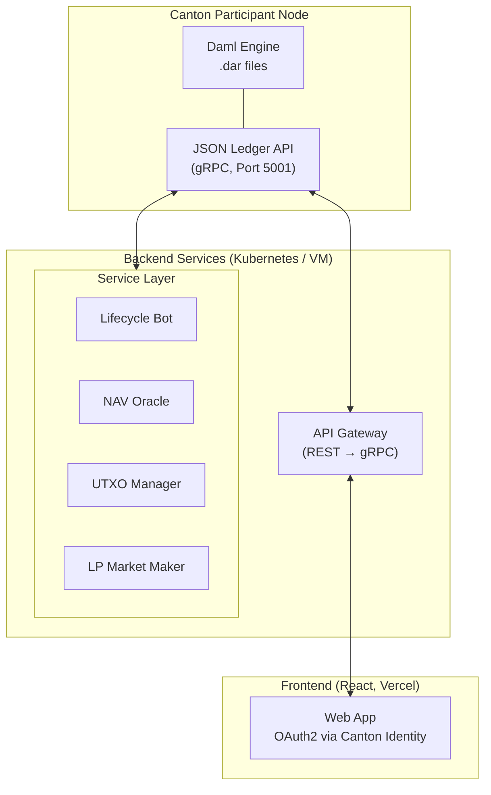

### 10.2 Deployment Sequence

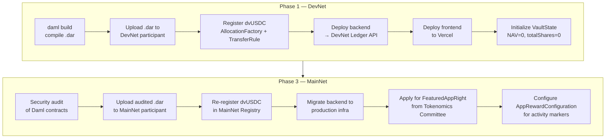

### 10.3 Contract Packages

```
ditto-vault-contracts/
├── daml.yaml
├── daml/
│   ├── DittoVault/
│   │   ├── VaultState.daml
│   │   ├── DepositOffer.daml
│   │   ├── WithdrawRequest.daml
│   │   ├── YieldClaim.daml
│   │   └── LiquidityPool.daml
│   └── Test/
│       ├── VaultStateTest.daml
│       ├── DepositFlowTest.daml
│       ├── WithdrawFlowTest.daml
│       └── YieldClaimTest.daml
└── .dar (compiled output)
```

---

## 11. Why Ditto?

Ditto Network provides the infrastructure backbone that makes autonomous yield generation on Canton possible — without relying on centralized intermediaries or manual treasury operations.

### Decentralized Operator Network

Vault transactions on EVM are secured by **16 institutional-grade operators** actively restaked across **Eigenlayer** and **Symbiotic**. This decentralized operator set eliminates single points of failure and ensures that no individual entity can unilaterally control fund movements or strategy execution.

### Economic Security

Operators collectively secure approximately **$200M in total value locked**, providing strong economic guarantees against malicious behavior. Slashing conditions enforced by the restaking protocols align operator incentives with depositor protection.

### Autonomous Execution with Guard Rails

Yield strategies on EVM run **fully autonomously** — allocations across Aave, Morpho, Fluid, and Spark are rebalanced without manual intervention. Every rebalancing action is validated by an on-chain **guard and risk management system** that enforces:

- **Whitelisted protocols only** — the allocator cannot deposit into unapproved venues
- **Position limits** — maximum exposure per protocol to prevent concentration risk
- **Slippage protection** — rebalance transactions revert if execution deviates beyond thresholds
- **Health factor monitoring** — automated de-risking if collateral ratios approach liquidation levels

### What This Means for Canton

Canton participants interacting with Ditto Vault benefit from institutional-grade security and automation without trusting a single operator. The yield flowing back to dvUSDC holders is generated by battle-tested infrastructure that has been live on Ethereum mainnet — now extended to Canton through CIP-56 tokenization.

---

## 12. References

| Resource | Link |
|---|---|
| CIP-56 Specification | [github.com/global-synchronizer-foundation/cips](https://github.com/global-synchronizer-foundation/cips/blob/main/cip-0056/cip-0056.md) |
| Canton Quickstart | [github.com/digital-asset/cn-quickstart](https://github.com/digital-asset/cn-quickstart) |
| Splice Token Standard APIs | [docs.dev.global.canton.network](https://docs.dev.global.canton.network.sync.global/app_dev/token_standard/index.html) |
| BurnMint API | [Splice-Api-Token-BurnMintV1](https://docs.dev.global.canton.network.sync.global/app_dev/api/splice-api-token-burn-mint-v1/Splice-Api-Token-BurnMintV1.html) |
| Splice Wallet Kernel SDK | [github.com/hyperledger-labs/splice-wallet-kernel](https://github.com/hyperledger-labs/splice-wallet-kernel) |
| Registry Utility | [docs.digitalasset.com](https://docs.digitalasset.com/utilities/devnet/overview/registry-user-guide/token-standard.html) |
| Activity Markers | [docs.digitalasset.com](https://docs.digitalasset.com/utilities/devnet/overview/registry-user-guide/activity-markers.html) |
| Circle xReserve | [developers.circle.com](https://developers.circle.com/xreserve/tutorials/deposit-usdc-on-ethereum-for-usdcx-on-canton) |
| Featured App Request | [canton.foundation](https://canton.foundation/featured-app-request/) |
| Daml Documentation | [docs.digitalasset.com](https://docs.digitalasset.com/build/3.4/tutorials/smart-contracts/intro.html) |

---

*Ditto Network — [dittonetwork.io](https://dittonetwork.io) · [@Ditto_Network](https://x.com/Ditto_Network) · [GitHub](https://github.com/dittonetwork)*
