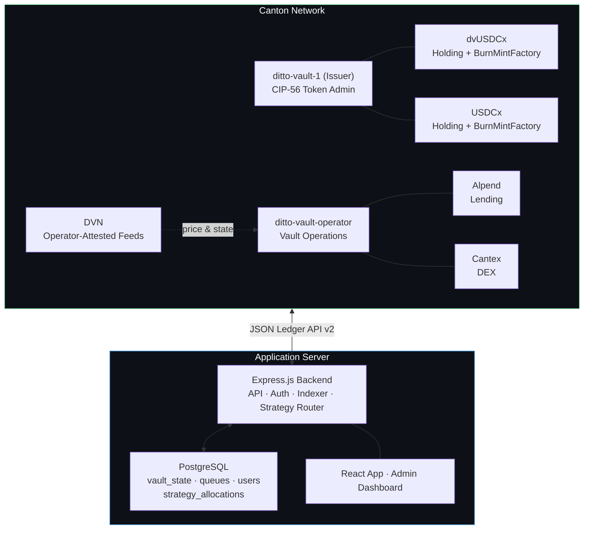
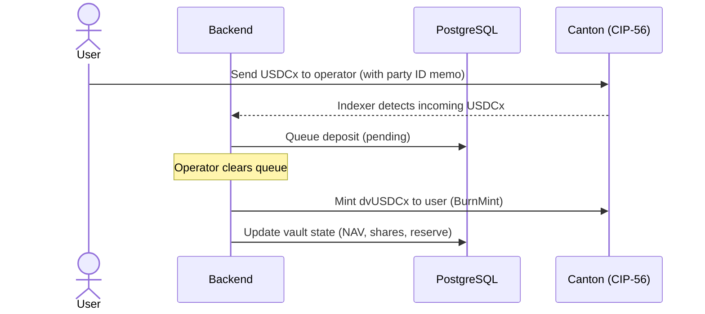

# Ditto Vault

**Canton-Native Yield Vault**

---

## Overview

Ditto Vault is a Canton-native asset management platform — a system for issuing and operating multi-strategy yield vaults on the Canton Network. The first product is `dvUSDCx-CORE`, a daily-liquid USDCx vault whose share token tracks an actively-managed allocation across Canton-native lending and DEX protocols. The architecture extends along three axes:

- **Permissionless retail variants** — `dvUSDCx-LOCK90`, `dvUSDCx-LOCK1Y`, `dvCC`, `dvCBTC` — different base assets, lock terms, and strategy mixes, all Canton-native.
- **KYC-gated tokenized fund marketplace** — `dvFOBXX`, `dvDLR`, `dvHQLAX`, `dvTDS`, plus private-credit-fund SPVs — accredited / institutional access to tokenized fund instruments already issued on Canton, wrapped under per-fund SPV structures.
- **Ethereum→Canton inbound onramp** — a Ditto-operated solver layered on CCTP-class partner rails, channeling USDC on Ethereum directly into Canton vault deposits in a single transaction.

All yield is generated **inside Canton**; no Canton balances are routed off-Canton for yield. Cross-chain capital flow is **inbound only** — external capital arrives on Canton via the solver and partner onramps, and from that point forward every dollar of vault NAV is held in a Canton-native protocol position or in idle reserves. All user-facing interactions on Canton are non-custodial CIP-56 transfers.

The platform is governed by Ditto Network — operator of 16 nodes across Eigenlayer and Symbiotic restaking infrastructure with $200M+ in cryptoeconomically-secured TVL — and is the reference application for the **Ditto Verification Network (DVN)**, an operator-attested price and state feed for the broader Canton DeFi ecosystem.

Vault accounting (NAV, share price, deposit/withdrawal queues, per-strategy allocations) lives in PostgreSQL; token Holdings, Factories, and **`NavAnchor` contracts** live on-chain. NAV is published on-chain on every harvest event and on a 6-hour heartbeat — making vault share price independently verifiable from chain state alone, without trusting any centralized API. This hybrid design keeps Canton traffic minimal while preserving full CIP-56 composability and trust-minimized share-price discovery across the entire vault lineup.

**Operator integration phases**: protocol integration (Alpend, Cantex) ships in three stages — Phase 4a runs as a manually-operated workflow with on-chain NAV receipts, Phase 4b adds CLI-driven semi-automation, Phase 4c is fully autonomous. v1 launch uses Phase 4a; this is honest about the team's operational burden in the first weeks of MainNet, and pairs deliberately with on-chain NAV publication so user trust does not depend on operator integrity alone.

---

## Architecture



**Three planes:** the on-chain plane is pure CIP-56 (tokens, party separation, factories). The off-chain plane is the strategy router, indexer, and accounting. The verification plane (DVN) sits between them, providing trust-minimized prices and protocol-state attestations that the router uses for allocation and risk decisions.

---

## CIP-56 Tokens

The platform issues one dvToken per vault, all under the same `ditto-vault-1` issuer party but with distinct `instrumentId.id` values. The first token is `dvUSDCx`; additional tokens follow the same pattern.

| Token | Issuer | Purpose | Standard |
|---|---|---|---|
| **dvUSDCx** | `ditto-vault-1` | `dvUSDCx-CORE` vault share — daily-liquid USDCx vault | CIP-56 Holding + BurnMintFactory |
| **dvUSDCx-LOCK90, dvUSDCx-LOCK1Y, dvCC, dvCBTC, …** *(future)* | `ditto-vault-1` | Additional vault shares — different base assets, lock terms, and strategy mixes | CIP-56 Holding + BurnMintFactory |
| **USDCx** | Circle (MainNet) / `usdcx-issuer` (DevNet test admin) | Stablecoin deposited by users, routed to strategies | CIP-56 Holding + BurnMintFactory |

Every dvToken is designed for registration as a Canton Featured App under CIP-47, with approval pending Phase 3 deliverables — see [Revenue Model](#revenue-model) for marker mechanics and [Featured App Alignment](#featured-app-alignment) for the Phase 3 prerequisites that gate marker eligibility.

All these tokens implement Splice CIP-56 token-standard interfaces. Holdings follow the UTXO model — minting burns inputs and creates outputs. Factories are nonconsuming, allowing multiple mint/burn operations in a single atomic batch.

**Party Separation (CIP-47 Compliant):** A dedicated issuer party (`ditto-vault-1`) signs all dvToken CIP-56 contracts and acts as the asset issuer for marker purposes. The operator party (`ditto-vault-operator`) manages vault operations and protocol allocations. This separation satisfies CIP-47 Rule 10 (Separate Party Concerns) — the precondition for asset-issuer Featured App marker eligibility on each dvToken.

**Metadata Passthrough:** The BurnMintFactory propagates `extraArgs.meta` into created Holdings, enabling on-chain memo tracking via the `dittonetwork.io/memo` key. The transaction indexer parses these to detect and route deposits and withdrawals automatically.

---

## Yield Strategies

The strategy router allocates each vault's base asset across mechanically distinct strategies on Canton-native protocols. The launch product `dvUSDCx-CORE` runs a four-leg allocation across Alpend (lending) and Cantex (DEX); future vaults reuse the same adapter framework with strategies appropriate to their base asset. The four legs of the launch product:

| Strategy | Venue | Mechanism | Primary risk |
|---|---|---|---|
| **Passive lending** | Alpend | Plain USDCx supply at variable rate | Protocol risk, utilization spikes |
| **Looped lending** | Alpend | Recursive supply-borrow-swap-resupply, capped to a safe LTV | Rate-spread inversion, liquidation |
| **Delta-hedged LP** | Cantex + Alpend | USDCx/CC LP with short-CC hedge sized to neutralize pool delta | Imperfect hedge, hedge funding cost |
| **Naked LP** *(off by default)* | Cantex | USDCx/CC LP with no hedge | Impermanent loss |

Plus a dynamic **idle buffer** (≥10% of NAV by default) sized to absorb instant withdrawals.

The strategy router's rebalance logic is rule-based — utilization spikes, rate inversions, hedge drift, leverage bands — not operator discretion over what to do. The *execution medium* varies by integration phase: Phase 4a runs the rule-driven decisions through manual operator workflows on protocol UIs; Phases 4b and 4c progressively automate the execution. See [STRATEGIES.md](./STRATEGIES.md) for the full mechanics, target weights, and rebalance rule set.

**Stable/stable strategy** *(future)* — the lowest-risk leg in any USDC-denominated vault is a stable/stable LP (e.g. USDC/USDT). No counter-stable to USDCx exists on Canton today; this strategy will be enabled as soon as one ships.

---

## Ethereum→Canton Capital Onboarding

The largest stablecoin liquidity pool today sits on Ethereum (and EVM L2s). To bring that capital into Canton-native yield without compromising the *yield generated inside Canton* principle, the platform ships an **inbound-only onramp** built on **Ditto's existing solver network** — the same operator set that secures $200M+ TVL across Eigenlayer and Symbiotic, extended to support EVM→Canton routes.

| Direction | Behavior |
|---|---|
| **Ethereum → Canton** | Supported. User signs one transaction on Ethereum with USDC; Ditto's solver network fronts USDCx on Canton from inventory and auto-deposits into the chosen vault. User receives dvTokens. |
| **Canton → Ethereum** | **Not supported.** No admin endpoint, no Daml choice, and no operator workflow can move Canton assets off Canton for yield. The contract surface is one-way by construction. |

### Architecture

The solver wraps a canonical CCTP-class rail (Circle CCTP or equivalent) for the settlement layer and adds:

- **Inventory-based fast settlement** — solver fronts USDCx on Canton against inventory; canonical mint replenishes in the background.
- **Single-transaction UX** — bridge + vault deposit collapsed into one user action.
- **Cross-chain attestation** — DVN attests that the user's Ethereum-side payment is final before Canton-side credit completes.
- **KYT/AML wiring** — partner-onramp compliance stack (Circle CCTP at launch); Ditto-side KYT pipeline added if volume justifies.

From the user's perspective: *deposit USDC on Ethereum, receive dvTokens on Canton, earn Canton-native yield.* No bridge transaction to track, no second signature, no Canton-side wallet setup required for the deposit itself (Canton receipt is held to user's named party).

This onramp is the platform's primary mechanism for growing on-Canton TVL: it channels existing stablecoin capital into Canton-native vault products and the KYC-gated marketplace tier, increasing on-Canton activity and TVL without any Canton-side balance ever leaving Canton.

---

## Tokenized Fund Marketplace (KYC-Gated)

Canton today hosts >$6T of tokenized RWA, dominated by institutional-grade fund instruments (Franklin Templeton FOBXX, Broadridge DLR, HQLAX, HSBC TDS, DTCC ComposerX, and a growing private-credit-fund SPV pipeline). Every one of these is issued under issuer-level KYC and is not directly investable from a permissionless retail vault.

The marketplace tier opens these instruments to accredited and institutional users via a **KYC-gated vault product line** sharing the same issuer (`ditto-vault-1`), the same `NavAnchor` infrastructure, and the same composability surface as the permissionless Core tier — but with:

- **One-time KYC at signup** unlocking the entire marketplace shelf (not per-deposit).
- **Per-fund SPV legal wrappers** routing capital from the marketplace dvToken to the underlying tokenized fund instrument.
- **DVN-attested NAV** from fund-admin reports — without DVN attestation the marketplace tier is uninvestable, because off-chain NAV would otherwise be unverifiable on-chain.

### Product structure

| Product audience | dvToken examples | Wraps |
|---|---|---|
| **Permissionless retail** | `dvUSDCx-CORE`, `dvUSDCx-LOCK90`, `dvUSDCx-LOCK1Y`, `dvCC`, `dvCBTC` | Canton-native lending + LP strategies |
| **KYC'd marketplace — money market** | `dvFOBXX`, `dvDLR` | Tokenized money-market shares |
| **KYC'd marketplace — collateral / HQLA** | `dvHQLAX`, `dvTDS` | Tokenized repo, HQLA, time deposits |
| **KYC'd marketplace — private credit** | `dvCredit-A`, `dvCredit-B`, … | SPV-wrapped LP interests in actively-managed credit funds, targeting 12%+ yield |

### SPV / legal wrapper structure

| Layer | Purpose |
|---|---|
| Marketplace user (KYC'd) | Holds `dvFundX` CIP-56 token in their wallet |
| `dvFundX` issuer | `ditto-vault-1` (same party as Core; Rule 10 isolation preserved because the issuer-only role applies to all dvTokens uniformly) |
| Vault operator | `ditto-vault-operator` (allocates pooled marketplace USDCx into the SPV) |
| **SPV (per fund)** | Bankruptcy-remote LLC / SP entity, KYC'd as the LP of record for the underlying fund. Holds the tokenized fund instrument. Issues the obligation backing `dvFundX`. |
| Tokenized fund issuer | FT / Broadridge / HQLAX / HSBC / private-credit-fund manager |

Coupon / interest flows: fund → SPV → operator → NAV update → `dvFundX` share-price tick. DVN attests the fund-admin's NAV reports on a regular cadence, making off-chain accounting tamper-evident on-chain.

The marketplace tier is the platform's path to fund-grade yield products at scale and the most direct way to engage Canton's institutional RWA base. It is partnership-led, multi-quarter, and ships per-product (not as a single launch). See [Roadmap](#roadmap) for sequencing.

---

## Ditto Verification Network (DVN)

Canton DeFi today has no native price oracle equivalent of Chainlink or Pyth. Lending and DEX protocols on Canton currently rely on undisclosed or self-reported price sources — a load-bearing systemic risk as TVL grows.

Ditto Network already operates a 16-node operator set across Eigenlayer and Symbiotic, securing $200M+ in restaking TVL. **DVN** repurposes that operator set as a quorum-attested price, state, and NAV attestation layer for the Canton ecosystem:

| Feed | Content | Cadence | Consumers |
|---|---|---|---|
| **Spot prices** | USDCx/CC, CC/USD, CBTC/USD, plus any CIP-56 token pair on demand | Per-block | Strategy router, lending markets, DEX oracles |
| **Protocol state** | Alpend market utilization, available liquidity, health factors; Cantex pool depth and fee accrual | Per-block | Strategy router, risk monitors |
| **RWA NAV attestation** | Off-chain fund-admin reports for tokenized money-market, collateral, and credit-fund instruments | Monthly / event-driven | Marketplace-tier vaults (`dvFOBXX`, `dvDLR`, `dvHQLAX`, `dvTDS`, private credit) |
| **Cross-chain finality** | Proof on Canton that an Ethereum-side onramp payment is final | Per ETH-side confirmation | Solver fast-path, onramp deposit indexer |
| **Cross-protocol health** | Aggregated risk attestations the strategy router uses for allocation decisions | Continuous | Strategy router |

The vault is the first internal consumer — every rebalance, hedge, and liquidation guard relies on DVN feeds — which makes DVN dogfooded before externalization. The marketplace tier and the onramp both depend on DVN: marketplace dvTokens compute share price from DVN-attested fund-admin NAV reports, and the solver fast path uses DVN cross-chain finality proofs to credit Canton deposits before canonical CCTP-class settlement completes. Once proven internally across these three consumers (vault, marketplace, onramp), the same feeds become a separate ecosystem product available to any Canton DeFi protocol under a basis-point licensing model.

> *Ditto's role in Canton DeFi is not just to operate a vault — it is to provide the verification layer that lets vaults, lending markets, and DEXes price assets and state safely on Canton.*

---

## Key Flows

### Deposit USDCx → receive dvUSDCx shares

Users send USDCx to the vault operator with a Canton party ID memo. The transaction indexer detects the incoming transfer and queues it. When the queue is cleared, dvUSDCx shares are minted to the user at the current share price.



### Redeem dvUSDCx → receive USDCx

Users send dvUSDCx back to the operator. The indexer queues a withdrawal. On clearing, the operator burns the dvUSDCx and sends USDCx back at the current share price. If the idle buffer plus immediately-recallable strategy liquidity is insufficient, withdrawals queue with a published SLA.

### Transfer dvUSDCx

Users can transfer dvUSDCx directly to any Canton party. Standard CIP-56 transfer with no backend involvement — generates a third-party transaction eligible for asset-issuer markers.

### Strategy allocation and harvest

The router moves USDCx between the idle buffer and the four strategy adapters based on real-time APY readings (sourced from DVN), utilization caps, and risk triggers. Harvest events realize accrued yield back into vault NAV, which is reflected in the dvUSDCx share price on the next accounting tick.

### Transaction indexer

A background service polls Canton's `/v2/updates` endpoint, watching for token movements to the operator party. Transactions carrying a `dittonetwork.io/memo` metadata key are automatically routed:

- **USDCx arriving at operator** → queued as a deposit
- **dvUSDCx arriving at operator** → queued as a withdrawal

Indexer state is crash-resilient via PostgreSQL-backed offset tracking and per-transaction deduplication.

---

## Vault Accounting

All vault state lives in PostgreSQL. NAV is **always derived** from vault holdings — never set manually.

| Field | Description |
|---|---|
| `nav` | Net Asset Value = `vault_reserve + Σ strategy_allocations.last_value` |
| `total_shares` | Total dvUSDCx shares outstanding |
| `share_price` | `nav / total_shares` — derived, never set |
| `vault_reserve` | Idle USDCx held by the operator party |
| `strategy_allocations` | Per-strategy table: protocol, asset, deployed amount, last marked value, last harvest timestamp |
| `is_paused` | Emergency pause flag |

**Yield raises share price:**

```
1. Users deposit 1000 USDCx → reserve=1000, NAV=1000, 1000 shares at $1.00
2. Router allocates 800 USDCx to Alpend passive supply
   reserve=200, alpend_supply.deployed=800, NAV=1000 (unchanged)
3. Alpend supply accrues 50 USDCx interest
   alpend_supply.last_value=850, NAV=1050, share_price=$1.05
4. User redeems 100 dvUSDCx → receives 105 USDCx (100 shares × $1.05)
```

---

## Tech Stack

| Layer | Technology |
|---|---|
| Token Contracts | Daml 3.x / CIP-56 (Holding + BurnMintFactory interfaces) |
| Network | Canton Network (Splice validator, DevNet / TestNet / MainNet) |
| Ledger API | Canton JSON Ledger API v2 (HTTP) |
| Backend | Node.js, TypeScript, Express |
| Database | PostgreSQL |
| Strategy Router | Adapter-per-protocol model (`AlpendSupply`, `AlpendLooped`, `CantexLpHedged`, `CantexLpNaked`) |
| Transaction Indexer | Background poller on `/v2/updates` with PostgreSQL state |
| User Auth | JWT (bcryptjs + jsonwebtoken) |
| Frontend (App) | React 19, Vite 7, TypeScript, Tailwind CSS v4, shadcn/ui |
| Frontend (Admin) | Vanilla HTML/JS + Tailwind CSS |
| Wallet Integration | Loop SDK (`@fivenorth/loop-sdk`) |
| Deployment | Docker Compose |

---

## User Interface

### User App (`/app`)

- Account overview with Party ID and operator address
- Portfolio cards: USDCx + dvUSDCx balances with Deposit, Redeem, and Send actions
- Deposit/Redeem via backend API (registered users) or Loop wallet (external wallet users)
- Pending deposits/withdrawals with status tracking
- Vault statistics: NAV, total shares, share price, blended APY, per-strategy allocation
- DevNet faucet for test tokens

### Admin Dashboard

- Operator authentication gate
- Real-time vault metrics: NAV, share price, total shares, vault reserve, per-strategy allocation
- Strategy router controls: allocate to / recall from any strategy adapter
- Queue management: view and clear pending deposits/withdrawals
- Vault controls: harvest strategies, pause/unpause, recompute NAV
- All-users view with on-chain USDCx and dvUSDCx balances

---

## Design Principles

1. **Canton-native only** — every strategy lives on a Canton-issued protocol. No bridges, no synthetic exposure, no off-Canton custody.
2. **Non-custodial only** — users hold their own tokens on-chain. No treasury party, no custodial balances. Maximizes third-party transaction volume for asset-issuer marker revenue.
3. **CIP-56 only on-chain** — token Holdings and Factories are the sole on-chain contracts. Vault accounting lives in PostgreSQL, reducing Canton traffic cost and UTXO complexity.
4. **Derived NAV** — NAV = vault_reserve + sum of strategy allocations. Share price is always derived, never manually set.
5. **Rule-based rebalancing** — strategy weights and risk triggers are deterministic, not operator-discretion. The *decision logic* is the same across integration phases; only the *execution medium* varies (manual UI in 4a, semi-automated CLI in 4b, fully autonomous in 4c). See [STRATEGIES.md](./STRATEGIES.md).
6. **Memo-based routing** — deposits and withdrawals use the sender's Canton party ID as a memo in `dittonetwork.io/memo`. The indexer parses and routes automatically.
7. **Separated issuer/operator parties** — `ditto-vault-1` (issuer) signs dvToken CIP-56 contracts. `ditto-vault-operator` manages vault operations and protocol interactions. Required by CIP-47 Rule 10 (Separate Party Concerns).
8. **Atomic CIP-56 operations** — multi-command submissions ensure all-or-nothing execution.
9. **Defense in depth** — admin JWT authentication on all operator endpoints. Reverse proxy domain-level route filtering isolates operator APIs from user-facing surfaces.

---

## Featured App Alignment

The platform is designed to satisfy each rule of the Featured App Coupon Guidance (revised 22 April 2026, effective 27 April 2026 21:00 UTC) from the Canton Tokenomics Committee.

The current guidance unifies the two coupon-generating paths — **Featured CC transfers** and **Featured App Markers** — under one set of rules. Both produce $1 of reward weight per use, and an app's total reward weight (markers + featured CC transfers) cannot exceed its net qualifying on-chain fees plus the synchronizer's free-traffic credit. Once CIP-0107 deploys to mainnet, featured CC transfers will produce on-chain markers directly, simplifying these calculations.

The platform's compliance map:

| Rule | What it requires | How the platform complies |
|---|---|---|
| **1. No redundant coupons on CC** | Coupons can come from featured CC transfers OR markers, but never both for the same activity | Operator-driven CC transfers (collateral posting on Alpend, swap legs on Cantex) are submitted **without** the Featured App Contract ID in the Transfer Context — unfeatured. The dvToken marker stream attaches only to dvToken instrument activity. |
| **2. Coupon-to-fee alignment** | Total coupon weight (markers + featured CC transfers) ≤ net qualifying on-chain fees + 0.1 MB/round free synchronizer credit | Marker submission service targets a 1.0 coupon-to-fee ratio over a 30-minute trailing window, including the 0.1 MB/round free traffic credit in the budget. |
| **3. No markers for marker submission cost** | Self-explanatory | Marker submission is batched via BatchV2; cost excluded from marker math. |
| **4. Markers only for on-chain fee-generating activity** | Off-chain reads/UI/API don't count | Only on-chain CIP-56 events (transfers, swaps, mints, burns) are claimed; oracle reads and dashboard interactions are not. |
| **5. Two-round timeliness** | Markers within ~20 minutes of underlying activity | Indexer plus marker batcher run on a 5–10 minute trigger with a 30-minute lookback window — no manual operator action. |
| **6. No net-paying users** | Cannot subsidize beyond user costs | Vault fee discounts (if any) are capped at user-borne traffic costs. |
| **7. No reward recycling** | Cannot earn markers on reward distributions | Yield distribution to vault holders is intra-vault accounting (share price ticks up); no separate distribution transactions. |
| **8. Asset issuer exception** | 1 marker per transaction submitted by a third party / transaction originator / venue, even when many asset movements are batched into one transaction | `ditto-vault-1` issues dvTokens; markers submitted on third-party-submitted transactions only, one marker per transaction regardless of dvToken movement count within that transaction. |
| **9. CIP-0056 compliance** | Asset must be holdable in 2+ wallets and tradeable on at least one DVP | Currently 1 of 2 wallets (Loop). Compliance is gated on Phase 3 deliverables: Console-wallet support and DVP listing on CantonSwap or equivalent. The platform is not eligible for asset-issuer marker rewards on a given dvToken until Phase 3 ships for that instrument. |
| **10. Separate party concerns** | Asset issuer party isolated from other functions | `ditto-vault-1` (issuer-only), `ditto-vault-operator` (vault ops, lending, LP), `ditto-oracle` (verification feeds — Phase 5). No party performs more than one major role. |

Additional alignment:

- **Economically motivated transactions** — every CIP-56 operation serves a genuine user need (deposit, withdrawal, transfer, allocation).
- **Metadata on-chain** — `dittonetwork.io/memo` key in Holding metadata enables verifiable transaction routing.
- **Featured App V2 API ready** — `splice-api-featured-app-v2` and `splice-util-featured-app-proxies` included as data dependencies for WalletUserProxy integration.
- **Composable ecosystem asset** — every dvToken is available as a CIP-56 token for any Canton application.
- **Active validator presence** — Ditto operates validators on Canton DevNet, TestNet, and MainNet.

---

## Revenue Model

Revenue compounds across the vault lineup. Each vault is its own AUM pool with its own fee schedule, and each dvToken is a CIP-56 instrument earning Canton Featured App asset-issuer markers under the Featured App Coupon Guidance (revised 22 April 2026, effective 27 April 2026 21:00 UTC).

### Per-vault fees (USDCx-denominated)

| Source | Mechanism | Indicative range |
|---|---|---|
| **Management fee** | % of vault AUM accrued continuously, charged via reduced share price | 0.5–2% annual |
| **Performance fee (carry)** | Share of yield above a published benchmark, accrued at harvest tick | 10–20% above benchmark |

Fee schedules are set per vault. Higher-risk and longer-locked vaults carry higher fees; the daily-liquid `dvUSDCx-CORE` is the lowest-fee tier. These are the **direct revenue lines** — denominated in USDCx, not subject to CC price.

### Asset-issuer markers (per dvToken, per third-party transaction)

Every dvToken is a CIP-56 instrument issued by `ditto-vault-1`, designed for registration as a Canton Featured App under CIP-47. Featured App approval and asset-issuer marker eligibility are pending Phase 3 prerequisites (Rule 9 — see [Featured App Alignment](#featured-app-alignment)). Per the asset-issuer rule (Rule 8 of the Featured App Coupon Guidance, revised 22 April 2026):

> Asset Issuers may submit **1 marker per transaction submitted by 3rd parties / transaction originator / venue**. Asset Issuers may only submit 1 marker even when the 3rd party batches many asset movements into a single transaction.

Each marker carries **$1 of reward weight**. Per the guidance, the ratio of reward paid to reward weight varies above and below 1:1, so realized revenue per marker is variable, not fixed. What counts as a third-party transaction for our dvTokens:

| Transaction class | Counts as third-party? | Marker stream |
|---|---|---|
| Mint at deposit clearing | ❌ — operator-submitted | None |
| Burn at redeem clearing | ❌ — operator-submitted | None |
| Peer-to-peer dvToken transfer (user-submitted from their wallet) | ✅ | 1 marker per tx |
| dvToken swap on a DVP venue (CantonSwap, Cantex, Silvana) | ✅ | 1 marker per tx |
| Composable use of dvTokens by third-party apps | ✅ | 1 marker per tx |

**Asset-issuer marker bound (Rules 1, 4, 8 combined)**: For a single dvToken instrument, the maximum issuer-claimable markers per reward round equals the number of distinct **third-party-submitted** on-chain transactions where that dvToken is genuinely used as the asset and the transaction itself generates traffic fees. Operator-submitted mints and burns at deposit/redeem clearing are excluded. Batched third-party transactions count once even when they include many dvToken movements.

**Operational consequence**: marker revenue tracks **secondary-market activity**, not deposit/redeem volume. The vault's economics depend materially on cultivating dvToken liquidity, market-maker integration, and DVP listings. This is why Phase 9 (Liquidity) is a revenue-driver, not a polish phase.

**Submission compliance**: markers are submitted by an automated backend service in batches every reward round, calibrated to a marker-to-transaction ratio of 1.0 over a 30-minute backwards-looking window — the methodology recommended in the official guidance.

Markers fire only on Canton-native transactions: dvTokens are issued and traded exclusively on Canton.

### Platform-level (future)

| Source | Mechanism |
|---|---|
| **DVN attestation fees** | Basis-point licensing in USDCx, paid by Canton DeFi protocols consuming DVN price/state feeds. Direct revenue, not marker-dependent. |
| **DVN markers** | Asset-issuer markers on oracle-attestation CIP-56 transactions when consumed by third-party protocols. Subject to ongoing alignment review with Canton Foundation; assumed material only at scale. |

---

## Roadmap

| Phase | Status | Scope |
|---|---|---|
| **Phase 1 — MVP** | ✅ Complete | CIP-56 tokens, deposit/withdraw queues, PostgreSQL vault accounting, React UI, Docker, DevNet validator |
| **Phase 2 — V2 Architecture** | ✅ Complete | Non-custodial only, party separation, metadata passthrough, transaction indexer, yield-based NAV, Loop wallet, admin dashboard |
| **Phase 3 — Featured App** | 🟡 In progress | Tokenomics Committee review, Rule 9 prerequisites (Console wallet integration + DVP listing on CantonSwap or equivalent), `FeaturedAppRight` + `WalletUserProxy` integration, automated marker submission service, `NavAnchor` on-chain publication infrastructure, DAR vetting on global topology |
| **Phase 4 — Strategy Router** | 🔵 Planned | Adapter framework, AlpendSupply + AlpendLooped + CantexLpHedged + CantexLpNaked, allocator + rebalancer, risk monitor. Sub-phases 4a (manual integration) → 4b (semi-automated) → 4c (fully autonomous) reflect operator-integration maturity, not separate features. |
| **Phase 5 — DVN (Internal)** | 🔵 Planned | Operator-quorum attestation contracts, on-chain feed publication, vault router integration, RWA NAV attestation primitives, cross-chain finality proofs |
| **Phase 6 — Ethereum→Canton Inbound Onramp** | 🔵 Planned | Ditto solver network extended for EVM→Canton routes, solver inventory party, onramp deposit indexer, CCTP-class partner-onramp fallbacks, frontend onramp module. **Inbound only — no outbound path.** |
| **Phase 7 — Vault Lineup Expansion (permissionless)** | 🔵 Planned | Additional permissionless vault products: `dvUSDCx-LOCK90`, `dvUSDCx-LOCK1Y`, `dvCC`, `dvCBTC`. Each its own CIP-56 instrument, fee schedule, and marker stream. |
| **Phase 8 — KYC-Gated Tokenized Fund Marketplace** | 🔵 Planned | Per-fund SPV legal wrappers, KYC stack at signup, marketplace dvTokens for tokenized money-market (FOBXX, DLR), collateral / HQLA (HQLAX, TDS), and private-credit-fund SPVs. DVN-attested NAV pipeline. Subsumes the prior "Private Credit Tranche" phase. |
| **Phase 9 — DVN (External)** | 🔵 Planned | Externalize DVN feeds to Canton DeFi protocols and tokenized fund issuers, basis-point licensing model |
| **Phase 10 — Liquidity** | 🔵 Planned | Secondary market for dvTokens via CantonSwap / Silvana, cross-app composability, market-making to drive marker velocity |

---

## About Ditto Network

**Canton Network presence**
- Validator operator on Canton DevNet, TestNet, and MainNet
- Active participant in the Canton ecosystem since early access
- CIP-56 token integration with working deposit/withdrawal/transfer flows
- CIP-47 Featured App readiness with party separation and metadata passthrough

**DeFi infrastructure track record**
- 16 node operators across Eigenlayer and Symbiotic restaking protocols
- Over $200M in TVL secured by a decentralized, slashable operator set
- Multi-year track record of running automated yield strategies and verifiable on-chain operations

---

## Documentation

- [ARCHITECTURE.md](./ARCHITECTURE.md) — full technical architecture
- [STRATEGIES.md](./STRATEGIES.md) — yield strategy mechanics, target weights, rebalance triggers, risk parameters

---

[dittonetwork.io](https://dittonetwork.io) · [@Ditto_Network](https://x.com/Ditto_Network) · [GitHub](https://github.com/dittonetwork)
